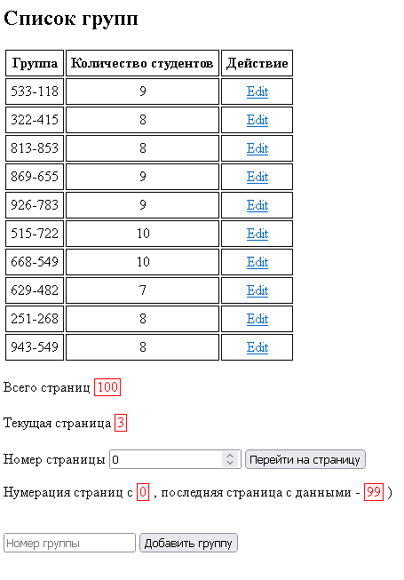
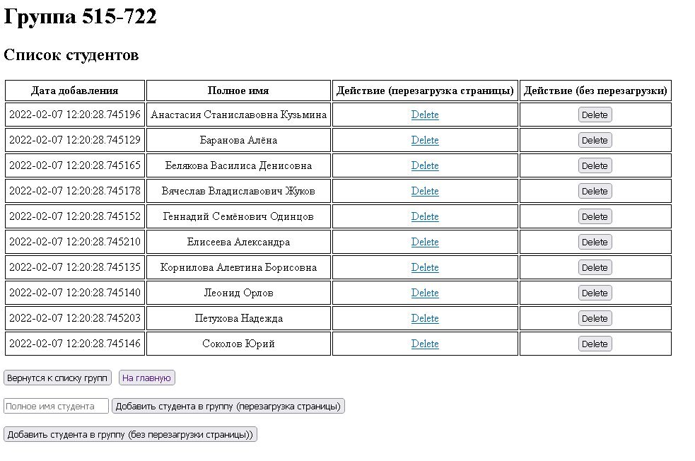
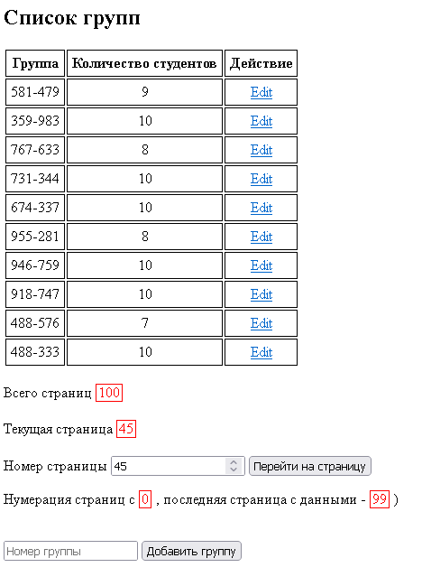
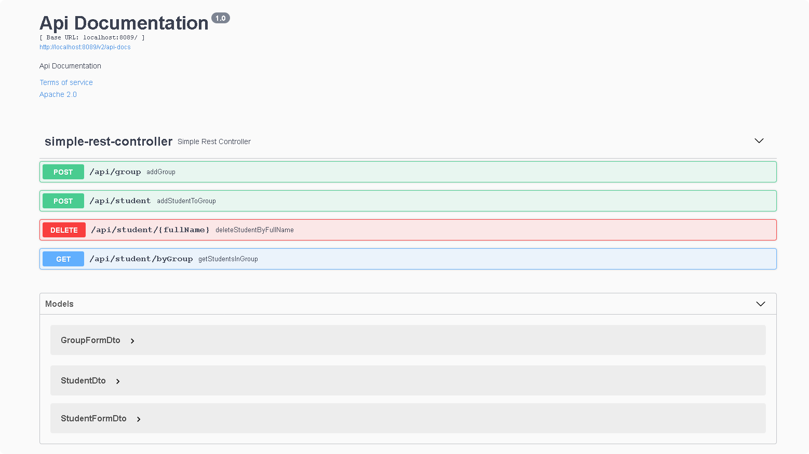
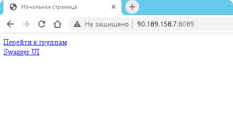
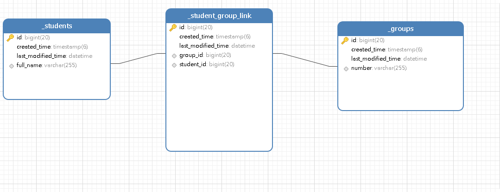

### Задача

Тестовое задание ScaleApp - смотри файл scaleapps-java-test03.

### Запуск программы

Для запуска потребуется установленный maven, git, jdk, Mysql server

Для запуска в Windows рекомендуется использовать Git Bash терминал.

Приложение сконифгурировано для запуска по адресу localhost:8089

Для MySql указаны следующие параметры (в application.yml) - 

адрес сервера - localhost:3306, login:password = root:root

Склонируйте репозиторий:
**git clone https://github.com/DmitryChebykin/group_manage_app.git**

**Выполните:**

cd group_manage_app (при необходимости отредактируйте group_manage_app\src\main\resources\application.yml )

mvn package

cd target

java -jar demo-spring-boot.jar 

или 

java -jar demo-spring-boot.jar --init (для наполнения базы данных демострационными данными)

Для тестовых данных генерируется около 10000 студентов с различными ФИО, которые распределяются примерно по 100 группам

